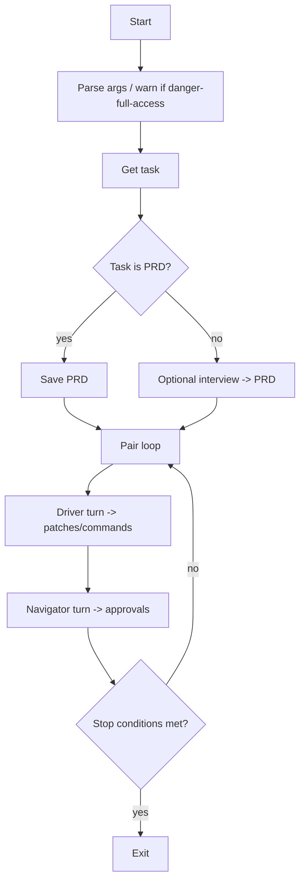

I utilize coding agents by pair-programming with them, with the agent being the driver and myself being the navigator. In this style of pair programming, the agent is the one holding the wheel, focusing on writing the code and finer details, while I observe the agent, reviewing its code, flagging issues, and suggesting next steps.

Today I had a random thought: what if I replace myself with another agent? What if 2 agents can pair program together by talking to each other?

With the help of Codex, I built a CLI called [**twindex**]() that pairs 2 Codex instances together and let them pair on a given task.

## Designing the CLI

The goal is simple: both Codexes have access to a PRD that is provided up front. The loop begins when the driver Codex starts its work. When it is done, a summary of its work is forwarded to navigator Codex, which then proceeds to review driver Codex's work. Crucially, navigator Codex is responsible for approving driver's commands (like how I have to approve Codex's request to run commands!) The navigator replies to the driver by giving it feedback comments, risks, and the commands that the driver is approved to run. This back and forth concludes a round. The loop stops when both agents agree to stop by outputting `OK_TO_STOP`.

Here is the program loop:

## Trial and Error

I expected this to be straightforward to build, but getting the 2 agents to work well together is surprisingly hard.

In particular, I have to be specific and literal about the prompt, because otherwise they will struggle to converge. In the first run, they spent 50 rounds on refining the PRD without writing a single line of code. I thought it would be a good idea to allow them to tweak the PRD, but in the end I had to explicitly forbid any edit to PRD in order to get them to put their engineer hats on.

Another quirk of Codex that caught me by surprise is that the driver would repeatedly run the same failing command again and again. An example is running `npm install` over and over because `npm` is unavailable. I would expect the agent to try other tools such as `bun`, but it did not. I had to add logic to cap retries and tweak the prompt to encourage changing the approach after encountering a failure.

## Is it better than single agent loop like Ralph?

The answer is I don't know. This dual agent harness mimics more of how a human interacts with an agent. Plus, it gives the agents a much tighter review feedback loop, compared to, e.g. a manual human review, or an agent review from an external tool. More importantly, having a separate agent instance review the driver's work gives it an unbiased view of the work due to a lack of context pollution, while having enough context of the work its reviewing by having access to a PRD. I will have to use twindex more to have a better feel of it.